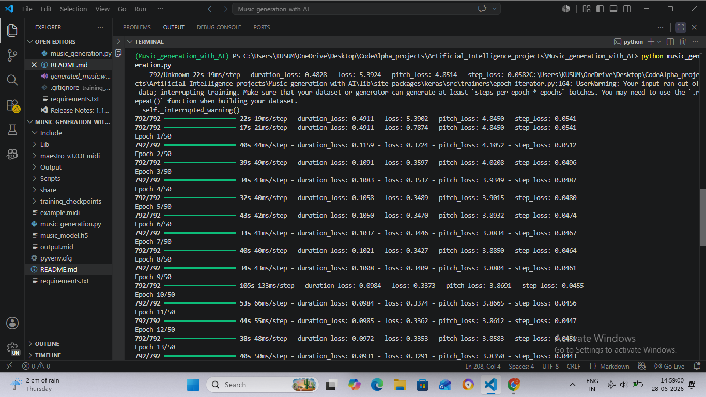
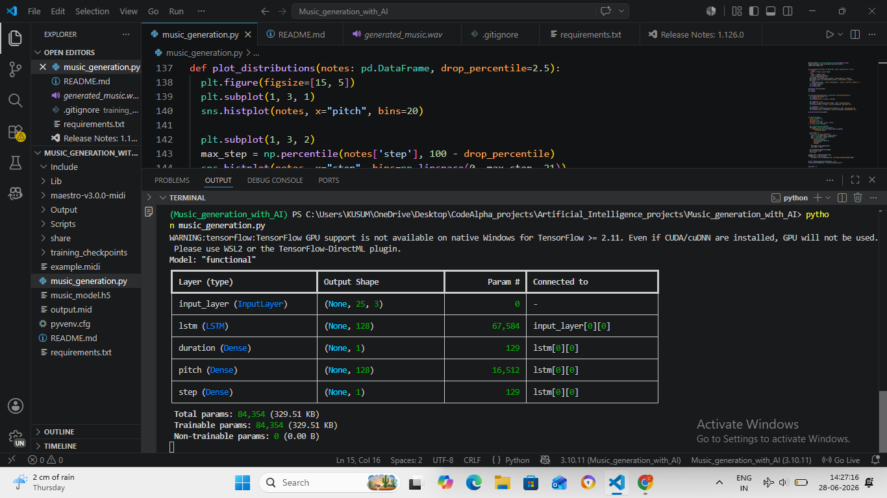
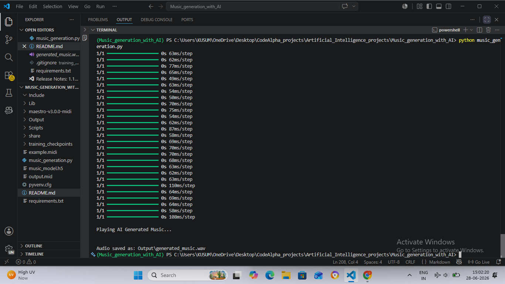

# 🎵 Music Generation with AI

An AI-powered Music Generation System built using **TensorFlow**, **LSTM Neural Networks**, and **PrettyMIDI**. The model learns musical patterns from MIDI files and generates entirely new melodies that can be saved and played as MIDI and WAV audio files.

---

## 📌 Project Overview

This project uses a Long Short-Term Memory (LSTM) neural network to learn note sequences from the MAESTRO MIDI dataset. After training, the model predicts the next musical notes to generate original piano melodies.

The project also allows users to:

- 🎼 Listen to the original MIDI music.
- 🎹 Listen to the reconstructed music from extracted notes.
- 🤖 Generate new AI-composed music.
- 💾 Save generated music in both MIDI and WAV formats.
- 📊 Visualize note distributions and piano rolls.

---

## 🚀 Features

- Extract musical notes from MIDI files.
- Convert MIDI notes into training sequences.
- Train an LSTM-based music generation model.
- Generate new music using sequence prediction.
- Convert generated notes back to MIDI.
- Save generated audio as WAV.
- Automatically play original and generated music.
- Visualize piano roll and note statistics.

---

## 🛠️ Technologies Used

- Python
- TensorFlow / Keras
- NumPy
- Pandas
- PrettyMIDI
- SciPy
- SoundDevice
- Matplotlib
- Seaborn

---

## 📂 Dataset

**MAESTRO v3.0.0 MIDI Dataset**

The dataset contains high-quality piano performances in MIDI format.

Dataset Link:

https://magenta.tensorflow.org/datasets/maestro

---

## 📁 Project Structure

```
Music_Generation_With_AI/
│
├── Output/
│   ├── original_music.wav
│   ├── reconstructed_music.wav
│   ├── generated_music.wav
│   ├── example.mid
│   └── output.mid
│
├── maestro-v3.0.0-midi/
│
├── training_checkpoints/
│
├── music_model.h5
├── main.py
├── requirements.txt
└── README.md
```

---

## ⚙️ Installation

Clone the repository

```bash
git clone https://github.com/Chandan-bt6/Music_Generation_With_AI.git
```

Move into the project

```bash
cd Music_generation_with_AI
```

Install dependencies

```bash
pip install -r requirements.txt
```

---

## ▶️ Run the Project

```bash
python music_generation.py
```

The project will:

- Load a sample MIDI file
- Play the original music
- Train the AI model
- Generate new music
- Save generated music
- Play the generated music

---

## 📊 Model Architecture

```
Input Note Sequence
        │
        ▼
LSTM Layer (128 Units)
        │
        ▼
Dense Layers
   ├── Pitch Prediction
   ├── Step Prediction
   └── Duration Prediction
        │
        ▼
Generated Music
```

---

## 📈 Training

- Optimizer: Adam
- Learning Rate: 0.005
- Epochs: 50
- Sequence Length: 25
- Batch Size: 64

---

## 🎼 Output

The project generates:

- Original Music (WAV)
- Reconstructed Music (WAV)
- AI Generated Music (WAV)
- Generated MIDI File

Example output:

```
Output/
│
├── original_music.wav
├── reconstructed_music.wav
├── generated_music.wav
├── example.mid
└── output.mid
```

---

## 📷 Screenshots

```
screenshots/

├──1.training_loss.png
├──2.note_event_representation.png
├──3.generated_music.png
├──4.terminal_output(1).png
├──5.terminal_output(2).png
└──6.terminal_output(3).png
```

Then include them here:

### Training Loss



### Note Event Representation



### Generated Music



### Terminal Output1

.png)

### Terminal Output2

.png)

### Terminal Output3

.png)
---

## 📌 Future Improvements

- Transformer-based Music Generation
- Streamlit Web Interface
- Genre Selection
- Mood-based Music Generation
- Multi-Instrument Support
- Real-time Music Generation
- Music Continuation Feature

---

## 👨‍💻 Author

**Chandan Bisht**

B.Tech Student | AI & Machine Learning Enthusiast

GitHub:
https://github.com/Chandan-bt6

LinkedIn:
(https://www.linkedin.com/in/chandan-bisht-264977300/)

---

## ⭐ If you found this project useful

Give this repository a ⭐ on GitHub!
